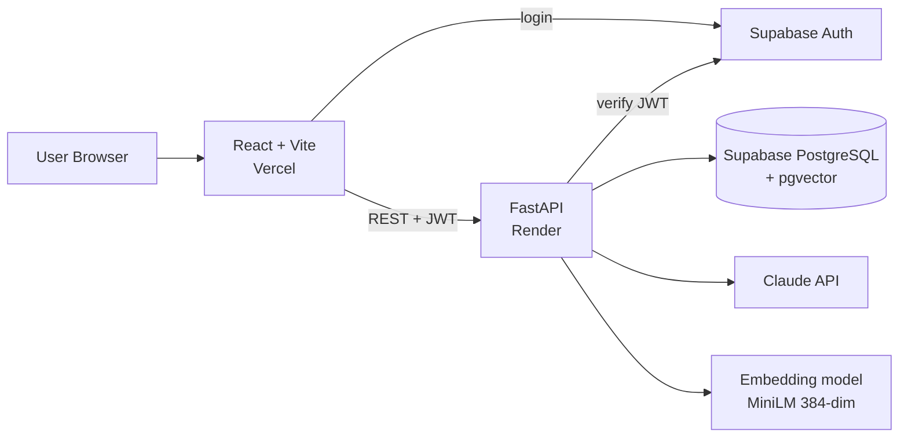

# Architecture and Database Schema

## 1. System overview

## 2. Backend layers (modular structure)

| Layer | Responsibility | Example folder |
|---|---|---|
| Routers | HTTP endpoints, validation, auth | `app/routers/` |
| Schemas | Pydantic request/response/JSON models | `app/schemas/` |
| Services | Business logic (parsing, matching, LLM) | `app/services/` |
| Models | SQLAlchemy tables | `app/models/` |
| Core | Config, security, rate limiting, logging | `app/core/` |

Rule: routers never call the LLM or database logic directly; they call services.

## 3. Analysis pipeline

1. Upload PDF -> validate type, size, and magic bytes.
2. PyMuPDF extracts text. If too little text, return "scanned or unreadable PDF".
3. Claude extracts structured resume JSON (with evidence snippets).
4. Verify each evidence snippet really appears in the resume text.
5. Claude extracts structured JD JSON.
6. Normalize skills (alias table).
7. Deterministic scoring engine computes category scores and overall score.
8. Claude generates suggestions and roadmap from the *scoring output*.
9. Save the analysis (without the PDF) and return the result.

## 4. Database schema

Tables (PostgreSQL). `user_id` refers to Supabase's `auth.users.id`.

| Table | Key columns | Notes |
|---|---|---|
| `skills` | `id`, `canonical_name` (unique), `category` | Canonical skill list |
| `skill_aliases` | `alias` (unique, lowercase), `skill_id` FK | "js" -> JavaScript |
| `resumes` | `id`, `user_id`, `filename`, `parsed` (JSONB), `created_at` | No PDF, no raw text stored |
| `resume_chunks` | `id`, `resume_id` FK (cascade), `text`, `embedding vector(384)` | For semantic matching |
| `job_descriptions` | `id`, `user_id`, `title`, `parsed` (JSONB), `created_at` | Pasted JDs |
| `jobs` | `id`, `title`, `company`, `description`, `location`, `work_mode`, `min_years`, `required_skills text[]`, `preferred_skills text[]`, `embedding vector(384)`, `is_demo bool`, `source` | Seed data flagged `is_demo = true` |
| `analyses` | `id`, `user_id`, `resume_id` FK, `jd_id` FK null, `job_id` FK null, `weights` (JSONB), `overall_score`, `category_scores` (JSONB), `result` (JSONB), `suggestions` (JSONB), `created_at` | Stores the weights used, for reproducibility |

Constraints and indexes:

- `work_mode` is one of `remote`, `hybrid`, `onsite`.
- Deleting a resume cascades to its chunks and analyses.
- Deleting an account deletes all rows with that `user_id`.
- Vector indexes (HNSW, cosine) on `jobs.embedding` and `resume_chunks.embedding`.
- Index on `analyses(user_id, created_at DESC)`.

## 5. Security summary

- API keys live only in backend environment variables.
- JWT verified on every private endpoint; every query filtered by `user_id`.
- Rate limiting per user and per IP; upload cap (5 MB, PDF only).
- Generic error messages to clients; details go only to server logs, never containing resume text.
- CORS allows only the known frontend origin.